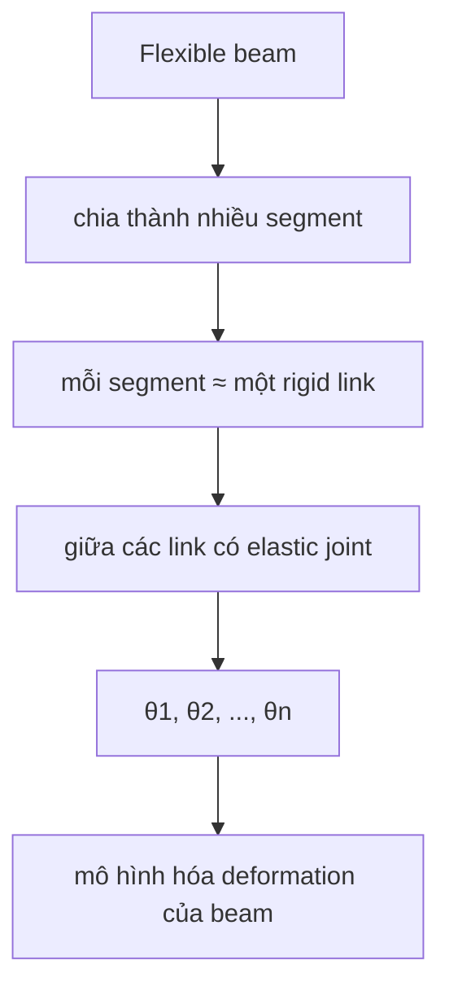

# Day2:

Content:

- Tại sao lại cần flexible beam ?
- Equation (1) thực sự đang nói gì?
- Forward kinematics và inverse kinematics nằm ở đâu trong pipeline?
- Tại sao sensing glove có thể biến deformation của beam thành joint angles của ngón tay?

## 1. Look-back:

**Equation(1):**

paper viết:

```math

g_{st,f}(\alpha_1,\alpha_2,\alpha_3,\alpha_4) = g_t = g_{st,b}(\phi_1,\phi_2,\phi_3,\phi_4)

```

> Beam tip và Finger tip đang bị ràng buộc cùng pose

```bash
Human finger
   │
   │ α1 α2 α3
   ▼
Finger kinematics
   │
   ▼
Finger tip pose
       ║
       ║  same physical tip
       ║
       ▼
Beam tip pose
   │
   │ φ1 φ2 φ3 φ4
   ▼
Flexible beam deformation
```

**Finger model:**

Paper đang giả sử mỗi ngón tay có 3 joints:

- PIP
- MCP
- DIP

và mỗi joint được giới hạn thành 1-DOF Hinge

Do đó finger được mô hình hoá thành 3-DOF serial linkage với 3 revoluate-joint

```math
\alpha =

\begin{bmatrix}
\alpha_1 \\
\alpha_2 \\
\alpha_3
\end{bmatrix}

```

và đây chính là `joint variables`

**Forward Kinematics:**

```math

(\alpha_1, \alpha_2, \alpha_3) \rightarrow g_{st, f}
```

và paper biểu diễn điều này lại bằng POE (product of exponental)

```math
g_{st,f} = e^{\hat{\eta_1}\alpha_1} e^{\hat{\eta_2}\alpha_2} e^{\hat{\eta_3}\alpha_3} g_{st,f_0}
```

**Sensing:**

với sensing thì ta cần đi ngược lại:

Khi dùng glove, ta **không trực tiếp biết**

$\alpha_1, \alpha_2, \alpha_3$

Ta chỉ đo được deformation của beam

$\phi_1, \phi_2, \phi_3, \phi_4$

Vậy phải làm

$\phi \rightarrow g_t \rightarrow \alpha$

Bước này gọi là **Inverse Kinematics**

```math
[\alpha_1, \alpha_2, \alpha_3]^T = g_{st,f}^{-1} \cdot g_{st, b}(\phi_1, \phi_2, \phi_3, \phi_4)
```

## 2. Explore Day-2:

### 1. Equation (4): (Biến đổi flexible beam thành serial mechanism)

```math

g_{st,b}(\theta) = e^{\hat{\eta_1}\theta_1} ... e^{\hat{\eta_n}\theta_n} g_{st, b_0}
```

Intuition:

Hiểu đơn giản trên công thức này thì mình back lại cái hình:

```bash
Initial:

───────────────→ x
●────●────●────●


Deformed:

      ╭────
   ╭──╯
●──╯
```

Thì workflow sẽ như thế này đây:



**Ngoài ra:**

Joint variables không chỉ là thoả các điều kiện về góc xoay giữa cái serial linkage mechanism, mà còn phải thoả mãn về `static equilibrium`

> [!NOTE] > **tóm tắt**
>
> nói đại khái là:
>
> Beam bị cong -> elastic joint được sinh ra restoring torque -> Torque này phải cân bằng với tác động của lực/wrench ở finger tip.

### 2. Equation 4 - 5:

Trước khi vào phần này:

Để thống nhất concept - thì pipeline chuyển đổi lúc này là:

```math
\phi \rightarrow \theta \rightarrow g_{t} \rightarrow \alpha

```

thì từ $\phi \rightarrow \theta$ phải thoả mãn sensors constraint + static equalibrium

theo paper:

**Equation(4): sensors constraint**

```math

p = S_e \theta - \Phi = 0

```

với

$\Phi = [\phi_1, \phi_2, \phi_3, \phi_4]^T$

> Nghĩa là 4 sensor measurements đang đặt constraint lên trạng thái deformation $\theta$ của toàn bộ beam

**Equation(5): Static Equilibrium**

```math
\tau = K_{\theta} \theta - J^{T}_{t} F_{t} = 0
```
