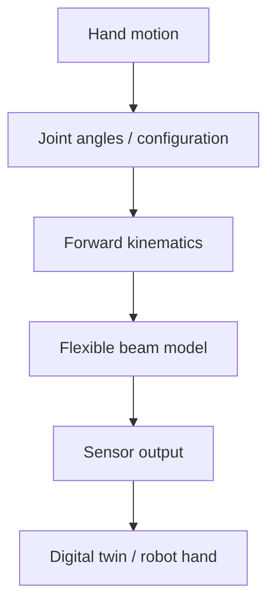
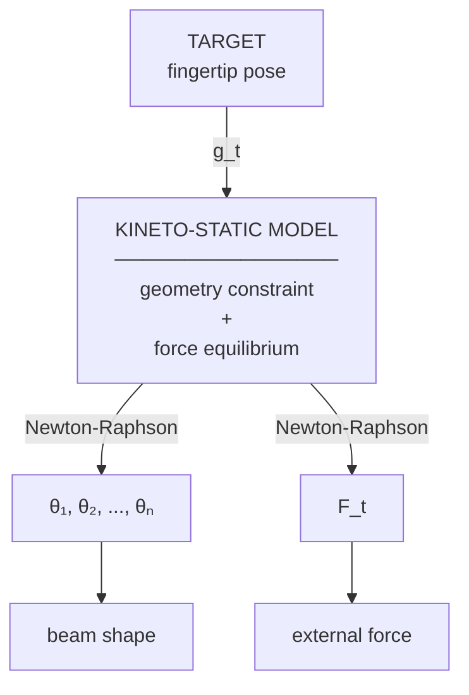
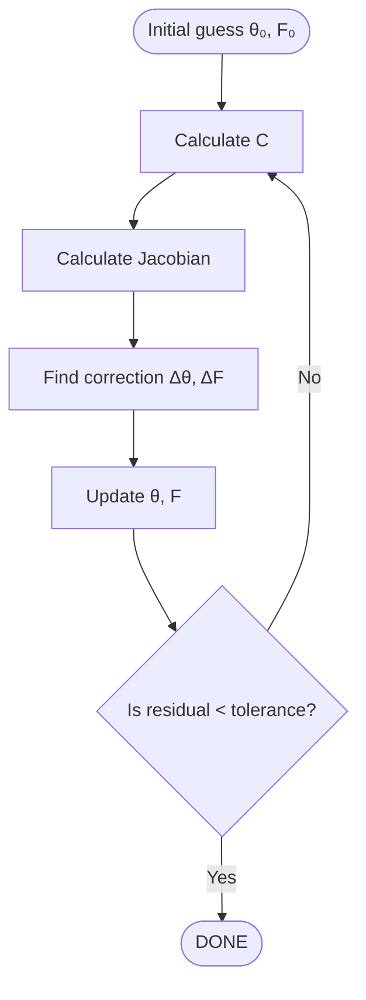

# Day3:

Pipeline sẽ đi là:



**Q1: Nếu có 1 ngón tay gồm nhiều joint, và biết các joint angle $\theta_1$, $\theta_2$, $\theta_3$ thì tại sao forward kinematics chưa đủ để mô tả chính xác một flexible sensor/glove?**

---

1. Forward kinematics: từ joint variables $\theta_{1 \rightarrow 3}$ $\rightarrow$ suy ra **pose**

2. Flexible beam inverse/reconstruction: từ trạng thái/discretization $\eta$ của beam $\rightarrow$ tìm configuration phù hợp với constraint/pose

Điểm cốt lõi là:

> Forward kinematics với các $\theta_{i}$ coi các đoạn giữa joint là những biến đổi hình học đã biết. Nhưng flexible beam không còn đơn giản là một chuỗi rigid links.

Nói cách khác, nếu ta có:

```math
\theta_1, \theta_2, \theta_3

```

thì với rigid-link model, về cơ bản ta có:

```math
T_{tip} = T_{1}(\theta_{1})T_{2}(\theta_{2})T_{3}(\theta_{3})

```

$\rightarrow$ ra position + orientation của fingertip.

Nhưng với **flexible beam**, giữa 2 điểm **díscretization** không nhất thiết giữ nguyên hình dạng như rigid link. Beam có thể **cong liên tục**

> [!NOTE]
>
> Không thể đơn giản chỉ dùng Forward kinematics để biểu diễn deformation liên tục của flexible beam vì:
>
> Ngón tay được mô hình hoá dưới dạng beam đàn hồi hơn là 1 chuỗi nối tiếp gồm các khâu cứng, nên cấu hình của nó không được biểu diễn chỉ bằng một tập hợp hữu hạn các góc khớp

**Q2: Giả sử có 2 flexible fingers có cùng fingertip position + orientation. Có chắc chắn hai ngón tay đang có cùng hình dạng cong không?**

---

Nếu 2 flexible fingers có cùng:

```math

\text{fingertip position} + \text{fingertip orientation}
```

thì chưa chắc chúng có cùng hình dạng cong

> Ngoài $\theta$, configuration còn phụ thuộc vào external force $F$ (và về đầy đủ hơn là các điều kiện/tác động cơ học khác)

Ví dụ trực giác:

- Finger A: bị tác động bởi một lực theo một hướng → cong sang trái.

- Finger B: chịu loading khác → cong theo profile khác.

- Nhưng cuối cùng cả hai có thể đạt cùng fingertip pose.

Vậy:

```math
\boxed{ \text{same fingertip pose} \not\Rightarrow \text{same beam shape} }
```

Và insight quan trọng hơn:

```math
\boxed{
\text{beam shape}=\text{f(configuration,loading,mechanical properties,…)}
}
```

## Kết nối sang $\eta$

Thay vì chỉ mô tả finger bằng:

```math
\theta_1, \theta_2, \theta_3
```

ta discretize flexible beam thành các phần tử/điểm

Mỗi điểm có một trạng thái kiểu:

```math
\eta_{i}
```

và toàn bộ beam được biểu diễn bởi:

```math
\boxed{
\eta = [\eta_1, \eta_2, ... \eta_n] ^ T
}

```

Khi đó bài toán không còn đơn giản là:

```math

\theta \rightarrow T_{tip}

```

mà trở thành kiểu

```math
\boxed{
\eta \rightarrow \text{beam configuration} \rightarrow \text{tip pose}
}
```

Và ta cần tìm giá trị $\eta$ sao cho configuration của beam thoả các constraint của hệ.

> Newton-Raphson đóng vai trò là `linearize` trong qui trình (Flexible-beam model tạo ra 1 hệ phương trình phi tuyến $\rightarrow$ cần một phương pháp numerical để tìm nghiệm $\rightarrow$ NewtonRaphson )

## Deep-dive to Paper

1. $\eta$ là gì ?
2. $F(\eta)$ là gì ?
3. Jacobian J = $\frac{\partial F}{\partial \eta}$ đang mô tả quan hệ vật lí nào ?

Trong paper này:

1. $\eta$ không dùng để biểu diễn `flexible beam` mà dùng nó là `joint twist`

   Ở phần finger:

   ```math
   g_{st,f} = e^{\hat{\eta_1} \alpha_1} e^{\hat{\eta_2} \alpha_2} e^{\hat{\eta_3} \alpha_3} g_{st,f_0}

   ```

   ở đây $\hat{\eta}_i$ là joint twist của các khớp ngón tay ban đầu, còn \alpha\_{i} là **finger joint angles**

   Nhưng sang flexible beam thì paper đổi sang:

   ```math
   \boxed{
       \theta = [\theta_1,...,\theta_n]^T
   }
   ```

   đây là joint variables của equivalent serial mechanism, với n elastic joints.

2. Insight:
   Flexible beam bần đầu là **hàm liên tục (tập hợp vô hạn)** $\rightarrow$ rất khó giải trực tiếp

   Paper làm một approximation:

   > chia beam thành nhiều segment nhỏ $\rightarrow$ mỗi segment được xấp xỉ bằng rigid-body-6-DOF $\rightarrow$ nối chùng bằng passive elastic joints.

   Kết quả là flexible beam được biến thành một hyperredundant multibody system.

   > Hyperredundant (Siêu dư thừa bậc tự do): Trong robot học, một robot được gọi là "dư thừa" (redundant) khi nó có nhiều khớp hơn mức tối thiểu cần để định vị bàn tay/cơ cấu chấp hành. Khi số lượng khớp này lớn hẳn lên (lên tới hàng chục hoặc hàng trăm khớp), tạo ra khả năng uốn lượn liên tục, nó được gọi là "siêu dư thừa".

   Nên:

   ```math

   \boxed{
       \text{flexible beam}
   }

   \rightarrow

   \boxed{
       \text{equivalent serial mechanism}
   }
   ```

   và:

   ```math
   \boxed{
       \theta_1, \theta_2...,\theta_n
   }

   ```

   chính là các biến mô tả trạng thái biến dạng của equivalent mechanism

3. Equation(7):

   Paper đang ghép 2 điều kiện:

   **Diều kiện 1: Geometric constraint**

   Từ `Foward kinematics` của beam:

   ```math

   g_{st,b}(\theta) = 0
   ```

   > Tức configuration $\theta$ phải làm tip của beam đạt target pose.

   **Điều kiện 2: static equilibrium**

   ```math
   \tau = K_{\theta} \theta - J^{T}_{t} F_{t} = 0

   ```

   > elastic restoring toruqe = torque do external wrench

   Hai cái này ghép lại thành:

   ```math
    \boxed{
   C(\theta,F_t) =
    \begin{bmatrix}
    y \\
    \tau
    \end{bmatrix} = 0
    }
   ```
Equation (7) đang gom 2 điều kiện thành 1 hệ nonlinear:

```math

C(\theta,F_{t})
= 
    \begin{bmatrix}
    y \\
    \tau
    \end{bmatrix} = 0
=
    \begin{bmatrix}
    (ln(g_{st,b} g_{t}^-{1}))^V \\
    K_{\theta} \theta - J_{t}^{T} F_{t} \\
    \end{bmatrix}
=0
```

Nó bắt hệ phải thõa mãn đồng thời 

1. Geometry 


```math
g_{st,b}(\theta) = g_{t}

```

$\rightarrow tìm $\theta$ sao cho beam biến dạng đúng cách để tip đạt target pose


2. Static equilibrium

```math

K_{\theta} \theta - J_{t}^{T} F_{t} = 0

```

$\rightarrow$ tìm $F_{t}$ sao cho **elastic restoring torque** của beam cân bằng với **external wrench** tại tip

Vậy: 

```math

g_{t} \rightarrow (\theta, F_{t})

```
> Nhưng không phải $g_t$ tự động cho ra $\theta,F_t$. Ta phải giải hệ nonlinear $C(\theta,F_t)=0$ bằng numerical method, cụ thể paper dùng `Newton--Raphson`. Paper mô tả hệ này có $(n+6)$ unknowns trong spatial case và giảm xuống $(n+3)$ trong planar configuration.

Từ đây mình suy ra 


Paper gọi toàn bộ cái này là `kinetostatic model`

## Eq.(7) $\rightarrow$ Jacobian $\rightarrow$ Newton-Raphson $\rightarrow$ actual numerical solution

Từ:

```math
C(\theta, F_{t}) = 0

```
> có nghĩa là tìm một trạng thái $(\theta, F_{t})$ sao cho cả **geometry** và **static equilibrium** cùng đúng.

**1. Jacobian đang trả lời câu hỏi gì ?**

> Jacobian dùng để trả lời câu hỏi "nếu tôi thay đổi một chút $\theta$ và $F_{t}$ thì **pose error** $y$ và **torque imbalance** $\tau$ sẽ thay đổi như thế nào ?

**2. Áp dụng Newton Raphson để tính ?**

Newton Raphson đang update các unknowns:

```math
\boxed{
\theta \text{ and } F_{t}
}

```

Trong đó $F_{t}$ là external wrench (force + moment)

Nó tìm correlation:
```math
\Delta{\theta}, \Delta{F_{t}}

```

sao cho residual:

```math
C(\theta, F_{t}) \text { tiến gần tới 0 }

```

> Newton–Raphson lặp lại việc cập nhật $\theta$ và $F_t$ cho đến khi residual $C$ đủ nhỏ theo convergence criterion/tolerance.

Conceptually

