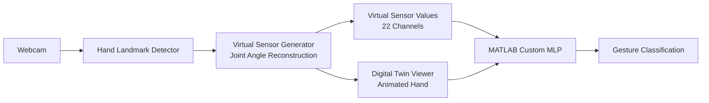

# Vision-Based Digital Twin of a Sensor Glove for Real-Time Hand Gesture Recognition
> This is continue develop to get the MVP for utilizing again the MLP that I have explored

## 1. WebCam
## 2. Hand-Landmark Detector