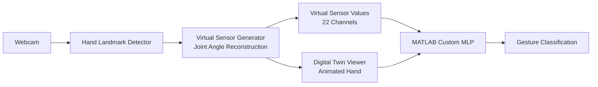
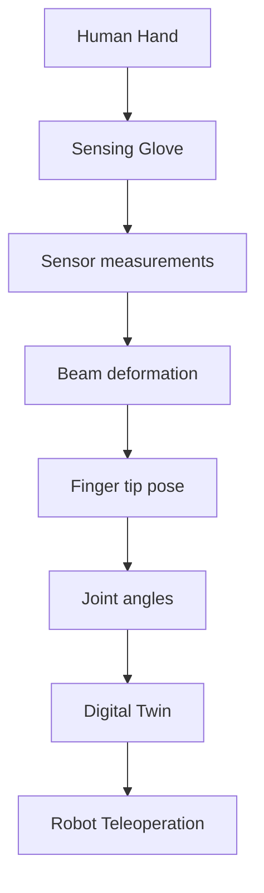
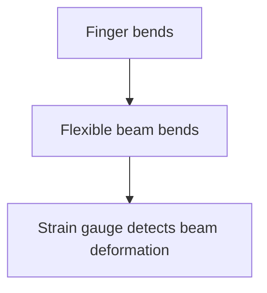
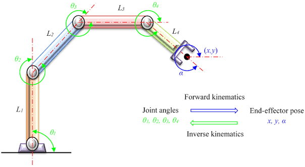

# Vision-Based Digital Twin of a Sensor Glove for Real-Time Hand Gesture Recognition

## Idea

> This is continue develop to get the MVP for utilizing again the MLP that I have explored



## Literature Review

### Bài toán tổng thể của paper

**Paper:**

> "A Compact Gesture Sensing Glove for Digital Twin of Hand Motion and Robot Teleoperation"

**Mục tiêu của paper:**

Mục tiêu của paper là dùng 1 sensing glove để capture chuyển động của ngón tay, sau đó restructure thành digital twin và cuối cùng dùng cho robot teleoperation.



### 1. Q1 -- `Strain Gauge` đo cái gì ?

`Strain gauge` không trực tiếp đo joint movement/joint angle

Nó đo:

```math
\text{local deformation} / \text{deflection của flexible beam}
```

Paper dùng 4 giá trị local deflection

```math
\Phi = [\phi_1​,\phi_2​,\phi_3​,\phi_4​]^T
```

để biểu diễn deformation tại các vị trí sensor

### 2. Q2 -- Tại sao `beam deformation` lại liên quan tới finger ?

Logic-straight-forward:



Lý do là **flexible beam** được nối với finger, đặc biệt một đầu beam được nối với **finger tip**.

Khi **finger tip** di chuyển:

```math

\text{finger movement} \rightarrow \text{beam deformation}

```

Do đó **beam** trở thành một **trung gian** để **sensing finger motion**

### 3. Q3 -- Tại sao từ `beam deformation` có thể suy ra `joint angle`

Phân biệt rõ:

```math

\text{beam deformation} \neq \text{joint angle trực tiếp}
```

Paper đi qua một chuỗi trung gian:

```mermaid
A[Beam deformation] --> B[Beam configuration]
B --> C[Beam tip pose]
C --> D[Finger tip pose]
D --> E[Inverse kinematics]
E --> F[Joint angles]
```

Paper mô hình hoá finger thành 3-DOF serial linkage gồm:

- MCP
- PIP
- DIP

và từ finger tip pose có thể dùng `inverse kinematics` để tìm `joint varibles`

### 4. Q4 -- Tại sao có nhiều sensor ?

1. Nếu tất cả sensor nằm cùng 1 vị trí: thì chúng chủ yếu quan sát cùng một vùng deformation

```bash
       S1 S2 S3 S4
          ↓↓↓↓
════════════════════
```

2. Đặt các vị trí khác nhau: ta thu được nhiều local deformation measurements khác nhau.

```bash
S1          S2          S3          S4
↓           ↓           ↓           ↓
●───────────●───────────●───────────●
```

> Paper đang sử dụng 4 strain gauges trên mỗi finger để tăng computational robustness và accuracy. Về mặt mô hình planar, tác giả nói ít nhất 3 strain gauges là cần thiết; họ chọn 4 để tăng robustness/accuracy

**Kết luận:** (quan trọng)

```math

\text{4 sensors} \rightarrow \text{4 local deformation measurements}
```

> Paper sẽ dùng những measurements này để reconstruct deformation/configuration của beam

### 5. Q5 -- Degree of Freedom Fingers:

Trong paper, finger được model thành

```math
\text{3 DOF}
```

với

```math
\text{MCP, PIP, DIP}
```

cho mô hình finger được sử dụng trong nghiên cứu.

### 6. Q6 -- Beam deformation -> finger tip như thế nào ?

biết được vị trí của finger tip thông qua beam tip bởi vì beam tip và finger tip được coupled

và điều này được paper biểu diễn thông qua công thức:

```math
g_{st,f} (\alpha_1, \alpha_2, \alpha_3) = g_t = g_{st,b}(\phi_1, \phi_2, \phi_3, \phi_4)

```

Tức finger tip pose and beam tip pose cùng được ràng buộc bởi 1 `coupling pose` $g_t$

### 7. Q7 -- Thuật ngữ xuất hiện SE(3) ?

```math

\text{SE(3)} = \text{Special Euclidean Group in 3D}
```

Trong robotics, nó được dùng để biểu diễn `Pose trong không gian 3D`

Pose gồm:

**Position**

```math
\text{x,y,z}
```

**Orientation**

```math
\text{R}
```

Do đó có thể hình dung

$$
T = \begin{bmatrix}
R & p \\
0 & 1
\end{bmatrix} \in SE(3)
$$

Trong đó:

- $R \in SO(3)$: Orientation (Rotation matrix)
- $p \in \mathbb{R}^3$: Position (Translation vector)

> SE(3) = cách biểu diễn position + orientation của một vật thể/frame trong 3D

### 8. Pose (`Pose = Position + Orientation`)

Trong robotics, thường được đề cập là pose của 1 frame/object

Có nghĩa là ta đang muốn biết vật đó đang ở đâu và đang hướng như thế nào

Có 2 thành phần

```math

\text{Pose = Position + Orientation}
```

**Position:**

thường có thể biểu diễn dưới dạng vector

```python
p = [x,y,z]
```

tức nghĩa ở đây thì nếu p = [10,5,20] -> thì trên toạ độ không gian 3 chiều thì finger tips đang có vị trí `x = 10`, `y = 5`, `z = 20`

**Orientation:**

giả sử fingertip có cùng 1 vị trí

```bash
             ●
             │
             ↑

             ●
             ↗

             ●
             →

```

thì mình có thể thấy là tuy cùng 1 vị trí (cả ba đều có cùng (x,y,z)) nhưng có các hướng khác nhau

> Đây là Orientation

Trong paper đề cập tới `orientation` được biểu diễn bằng 1 rotation matrix:

```math
\text{R} \dep \text{SO(3)}
```

với R = `Orientation`

**Kết luận**

```bash
Finger

MCP          PIP          DIP
 ●────────────●────────────●───●
                              ↑
                              │
                         finger tip

```

ta muốn biết:

```math
g_t = \text{pose của finger tip}
```

Trong đó:

```math
g_t = (position_{x,y,z}, orientation_{R})

```

### 9. Forward Kinematics and Reversed Kinematics

Cho dễ hình dung - đây là hình ảnh của 1 finger tips pose:



**1. Forward Kinematics:**

> Biết joint angles -> tìm tip poses

**2. Reversed Kinematics:**

> Từ tip pose -> để tìm được joint angles

Câu hỏi: Gốc toạ độ được đặt ở đâu:

Trong mô hình paper, `spatial frame` S được đặt tại gốc của finger.

Và paper có 1 frame khác ở tip:

- $S$: spatial frame
- $T$: finger tip frame

Transformation trong paper là: $g_{st, f}$

nghĩa là:

> pose của frame T (`finger tip frame`) đối với frame S (`spatial frame`)
